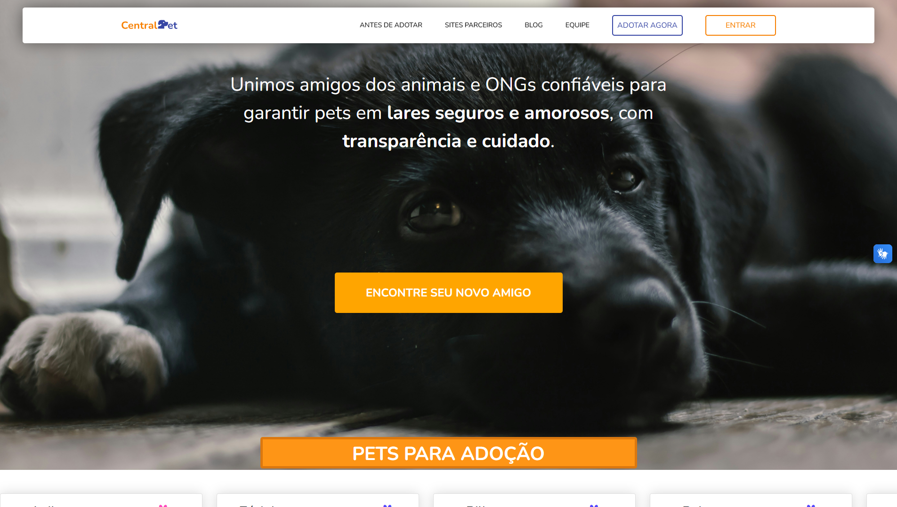
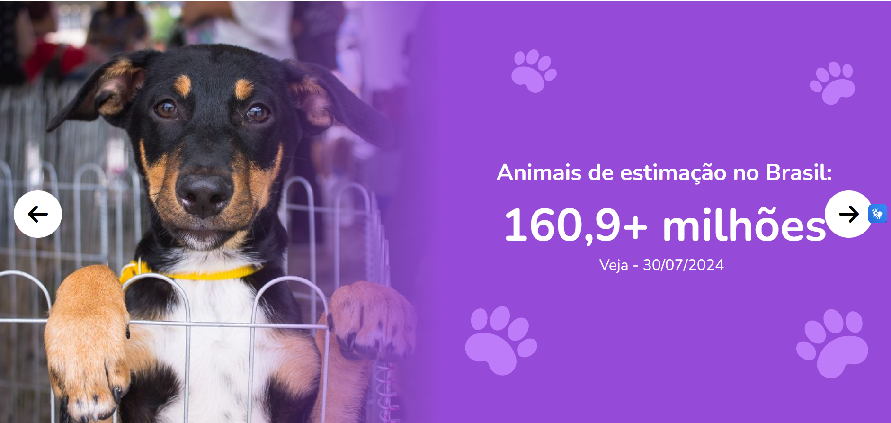
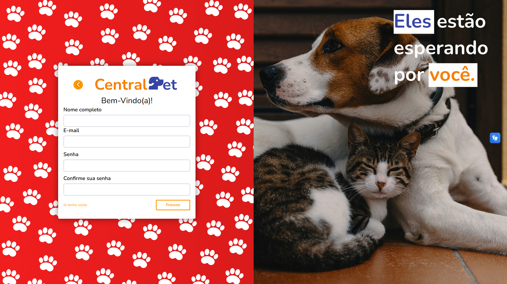
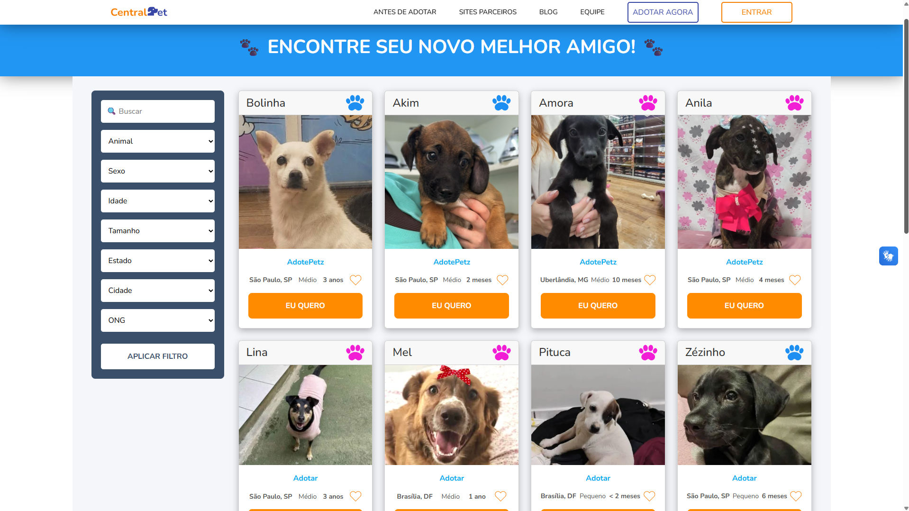

# CentralPet 🐾

A **CentralPet** é uma plataforma web que conecta pessoas interessadas em adoção de pets e cuidados com animais. Ela agrega informações sobre animais disponíveis para adoção e notícias do mundo pet, direcionando os usuários para os sites e ONGs parceiras de forma prática e segura. A ideia é que o usuário prefira usar nossa plataforma como ponto central de consulta, em vez de navegar em múltiplos sites.

Além disso, a CentralPet oferece:  
- ⭐ Sistema de avaliação de parceiros (ONGs e sites de adoção)  
- ♿ Funcionalidades de acessibilidade, incluindo leitor de Libras e leitor de texto em voz  
- 📰 Blog com portal de notícias sobre pets

---

## Funcionalidades ✨

- 🐶 Consulta centralizada de pets disponíveis para adoção  
- 🔗 Redirecionamento para o site específico de adoção escolhido pelo usuário  
- ⭐ Sistema de avaliação para parceiros (ONGs e sites de adoção)  
- 📰 Blog com notícias e dicas sobre cuidados com animais  
- ♿ Funcionalidades de acessibilidade:  
  - 🖐 Leitor de Libras  
  - 🔊 Leitor de texto em voz  
- 💻 Compatível com múltiplas plataformas (desktop e mobile)

---

## Screenshots 🖼️

  
  
  

---

## Demonstração 🚀

Acesse a demo no GitHub Pages: [🌐 Ver Demo](https://centralpett.github.io/CentralPet/)

---

## Redes Sociais 📱

- [Facebook 👍](https://www.facebook.com/people/CentralPet/61579769613990/)  
- [Instagram 📸](https://www.instagram.com/sitecentralpet)

---

## Tecnologias utilizadas 🛠️

- HTML  
- CSS  
- JavaScript  
- GitHub Pages

---

## Como usar 📝

1. Acesse a página da CentralPet pelo link da demo ou clone o repositório.  
2. Navegue pelo catálogo de pets ou pelo blog de notícias.  
3. Ao escolher um pet para adoção, você será redirecionado para o site parceiro responsável pelo processo.  
4. Avalie os parceiros para ajudar outros usuários a escolherem os melhores serviços.

---

## FAQ ❓

#### Como funciona o processo de adoção?

O CentralPet apenas direciona você para o site parceiro. Todo o processo de adoção é responsabilidade do site ou ONG parceiro.

#### A CentralPet oferece suporte em acessibilidade?

Sim! A plataforma possui leitor de Libras e leitor de texto em voz para facilitar o acesso às informações.

---

## Equipe 👥

Nossa equipe reúne profissionais dedicados a promover a adoção consciente e dar visibilidade a ONGs, protetores e histórias inspiradoras.

| Nome | Email | GitHub | LinkedIn |
|------|-------|--------|----------|
| Alberth Shingler Mendes Nery | alberthsm.nery@gmail.com | [GitHub](https://github.com/asmnery) | [LinkedIn](https://www.linkedin.com/in/asmnery/) |
| Vitor Mota Novais de Jesus | vitormotanovais@gmail.com | [GitHub](https://github.com/VitorMotaNJ) | [LinkedIn](https://www.linkedin.com/in/vitor-mota-330908227/) |
| Matheus Silva Dias | contato.mthdias@gmail.com | [GitHub](https://github.com/MatheusDias10) | [LinkedIn](https://www.linkedin.com/in/matheus-dias-71982b333/) |
| Jhuan Pablo dos Santos | jhuanpablo03@gmail.com | [GitHub](https://github.com/Jhuan03) | [LinkedIn](https://www.linkedin.com/in/jhuan03) |
| Marcos Augusto da Silva Vieira Franco | marcosilv090@gmail.com | [GitHub](https://github.com/AkiraNohara696) | [LinkedIn](https://www.linkedin.com/in/marcos-augusto-591019342/) |
| Victor Hugo dos Santos Almeida | victorhugosantos2610@gmail.com | [GitHub](https://github.com/Victor-programmer) | [LinkedIn](https://www.linkedin.com/in/desenvolvedor-victor-almeida/) |
